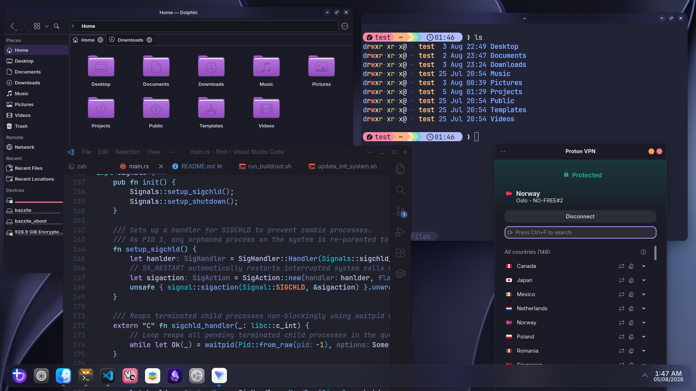

# 🚀 Workstation OS

An immutable, custom-built Fedora Atomic spin built with [BlueBuild](https://blue-build.org/) and powered by **Bazzite (KDE / NVIDIA)**. Engineered as an all-in-one distribution tailored for modern software development, seamless virtualization, privacy-first networking, and zero-compromise gaming.

---


---

## ✨ Highlights

* **Base Infrastructure:** Built on `bazzite-nvidia-open:latest` for cutting-edge kernel features, immutable stability, and out-of-the-box NVIDIA graphics support.
* **Modernized KDE Plasma:** Polished with custom blurred visuals (`kwin-effects-better-blur-dx`), Kvantum engine, Klassy window decorations, and Panel Colorizer.
* **Dev-First Environment:** Native VSCode (`code`) with full host system access for system-level editing (`/etc`, system configs), coupled with `mise` and `distrobox`.
* **Out-of-the-Box Virtualization:** KVM/QEMU, Libvirt, and Docker with `swtpm` directory permissions pre-configured for running modern virtual machines (including Windows guests via **Winboat**).
* **Hardened Privacy & Security:** Quad9 DNS over TLS (DoT), ProtonVPN pre-configured, strict firewall defaults tuned to preserve local NFS and local printing access.
* **Streamlined CLI Experience:** Default system-wide `zsh` configured via Zinit with asynchronous autosuggestions, syntax highlighting, Starship prompt, and modern Rust-based CLI replacements.

---

## 🛠️ Included Software Stack

### Built-in Flatpak App Suite

A curated selection of desktop applications installed at the user level:

| Application                 | ID                              | Purpose                                        |
| --------------------------- | ------------------------------- | ---------------------------------------------- |
| **Zen Browser**             | `app.zen_browser.zen`           | Privacy-focused modern browser                 |
| **OnlyOffice**              | `org.onlyoffice.desktopeditors` | Office productivity suite                      |
| **Obsidian**                | `md.obsidian.Obsidian`          | Knowledge base and note-taking                 |
| **OBS Studio**              | `com.obsproject.Studio`         | Screen recording & streaming                   |
| **Vesktop**                 | `dev.vencord.Vesktop`           | Discord client with Vencord enhancements       |
| **LocalSend**               | `org.localsend.localsend_app`   | Local network cross-platform file sharing      |
| **GearLever**               | `it.mijorus.gearlever`          | AppImage management and integration            |
| **DistroShelf**             | `com.ranfdev.DistroShelf`       | Graphical manager for Distrobox containers     |
| **Flatseal**                | `com.github.tchx84.Flatseal`    | Graphical Flatpak permission manager           |
| **Media Writer**            | `org.fedoraproject.MediaWriter` | USB ISO flasher                                |
| **Piper**                   | `org.freedesktop.Piper`         | Gaming mouse & peripheral configuration        |
| **Okular / Gwenview / VLC** | System Utilities                | PDF viewing, image viewing, and media playback |

---

### Terminal & CLI Tools

Standard GNU tools are aliased to modern alternatives within the pre-packaged Zsh configuration:

```text
 ls   --->  eza -l --color=auto      (Modern file listing with icons)
 tree --->  eza --tree               (Tree view)
 cat  --->  bat                      (Syntax-highlighted cat)
 grep --->  ripgrep (rg)             (Blazing fast searching)
 find --->  fd                       (Fast file finder)
 top  --->  btop                     (Resource monitor)
 cd   --->  zoxide (z)               (Smart directory navigation)
 help --->  tldr                     (Simplified man pages)

```

Additional native utilities pre-installed: `yazi`, `fzf`, `jq`, `yq`, `gh`, `distrobox`, and `mise`.

---

## 🔒 Network, Firewall & Privacy Settings

* **DNS Security:** Configured to use **Quad9** with compulsory **DNS-over-TLS (DoT)**, preserved via a custom portal framework to handle Wi-Fi captive portals without leaking unencrypted queries.
* **VPN:** ProtonVPN desktop suite ready out of the box.
* **Firewall Strategy:** Inbound traffic strictly filtered while maintaining out-of-the-box local subnet permissions for **Network Printers** and **NFS Shares**.

---

## 🚀 Virtualization Setup (KVM + Docker)

Virtualization services (`libvirtd`, `docker`) are enabled at the system level upon first boot.

1. **Windows Guests / Winboat:** Fully pre-configured with TPM 2.0 emulation directory structures (`/var/lib/swtpm-localca`) and SELinux contexts so Winboat works out of the box.
2. **KVM Tweaks:** Kernel parameters are applied via `kargs` to ensure smooth nested virtualization:
* `kvm.ignore_msrs=1`
* `kvm.report_ignored_msrs=0`


---

## 📥 Installation

Because this image is produced using BlueBuild on top of Fedora Atomic / Bazzite, you can rebase an existing Fedora Silverblue, Kinite, or Bazzite system to this image:

```bash
# Rebase to your OCI container image
rpm-ostree rebase ostree-unverified-registry:ghcr.io/YOUR_GITHUB_USERNAME/workstation:latest

```

After the rebase completes, restart your system:

```bash
systemctl reboot

```